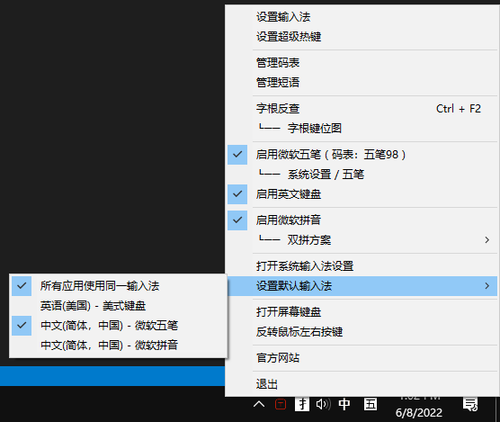

# WubiLex ( 五笔助手 )
> <a href="http://wubi.aardio.com/update/WubiLex.7z">点这里下载 WubiLex( 五笔助手 )，</a>  体积仅 818KB。   
> 软件全部功能与界面使用纯 <a href="http://www.aardio.com/">aardio 编程语言(开发环境仅 6.5MB)</a> 实现。 

请参考：<a href="https://mp.weixin.qq.com/s/-bdN1oypEdpHhx_SKx2p-Q">官方微信 | 意见反馈 | 教程</a>

WubiLex 可替换 Win10/Win11 自带微软五笔的系统码表、短语词库，软件已自带五笔86、98、091、新世纪、小鹤音形、郑码、表形码 …… 等码表。

WubiLex 也支持一键智能造词 —— 利用空码自动补全流行词，这通常可以添加十几万的流行词。再也不用手动加词了。

WubiLex 可以兼容很多的码表格式，例如词前码后、码前词后，一码一行，一行多码等等。可以导入导出CSV、JSON、以及LZMA压缩格式码表。

WubiLex 也支持直接编辑五笔短语词库，并扩展了微软五笔短语的功能，兼容各种短语词库格式，支持方便的自定义特殊字符数组。

WubiLex 提供了方便的反查拆字功能。按 Ctrl + F2 反查五笔编码，再Ctrl + F2 回到原来窗口不影响继续输入。反查可显示详细的拆字图解（五笔反查不仅支持单字，也可以支持词组）。并提供虚拟键盘准确显示按键方位，鼠标悬停在虚拟键上可显示单键字根图。反查会展示标准书写笔顺动画 （ 小技巧: 动画结束后用鼠标点击可重现播放 ）。

反查时可通过虚拟键盘准确显示按键方位，鼠标悬停在虚拟键上可显示单键字根图。

我们一般看到的五笔字根图都是包含所有按键字根的全图，但是这种字根图会让人眼花缭乱，如果我们的眼睛看到的内容越多，记忆效率就会越低。所以我制作了这种简洁版的虚拟键盘。

WubiLex 还提供了强大的「超级热键」功能（ ImTip 也支持超级热键 ），可以用于扩展输入法功能，例如输入数字后自动将句号转换为小数点，输入大写中文数字的中文日期等等。

  

例如按超级热键 Ctrl+$ 打开财务大写、日期时间大写、数学运算工具。

 

请参考：<a href="https://mp.weixin.qq.com/s/-bdN1oypEdpHhx_SKx2p-Q">官方微信 | 超级热键大全 | 教程</a>

WubiLex 的帮助页面收集整理了很多微软五笔常用快捷键、用法帮助。  
注意：Win10 2004 以上版本已经可以关闭 Shift, Ctrl+Space 等快捷键。  

并提供了五笔86、五笔98、五笔新世纪（06版）、五笔091、郑码等字根图，
整理收集了所有可以直接复制粘贴的文本字根(不需要安装自定义字体)

 
WubiLex 还可以快捷开关、切换英文键盘、微软五笔、微软拼音，并可方便地切换微软双拼方案。如果小鹤双拼方案未安装仍然会出现在双拼候选列表中 —— 勾选即可自动安装。

 
