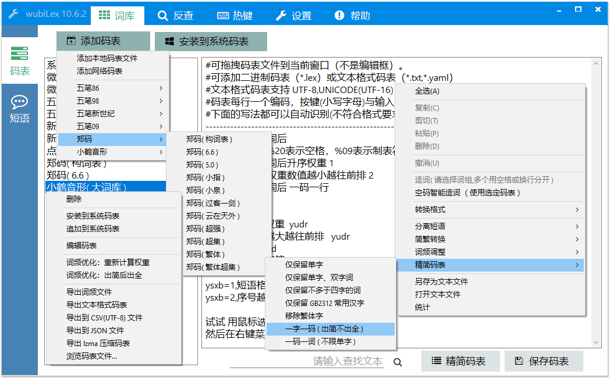
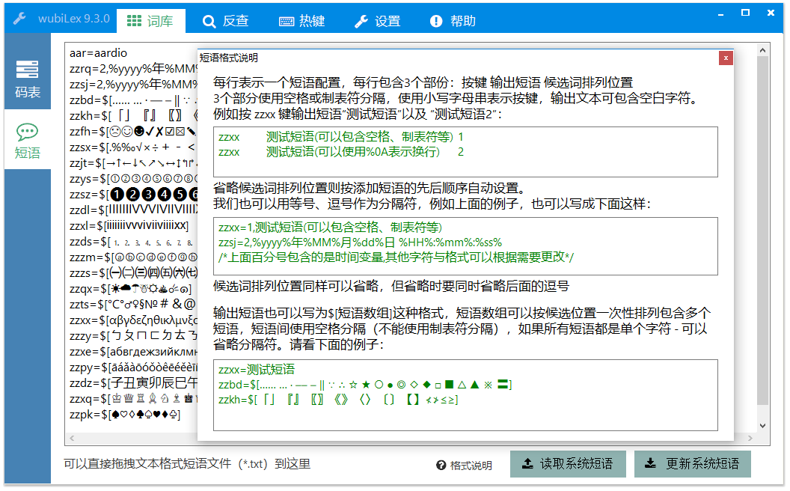
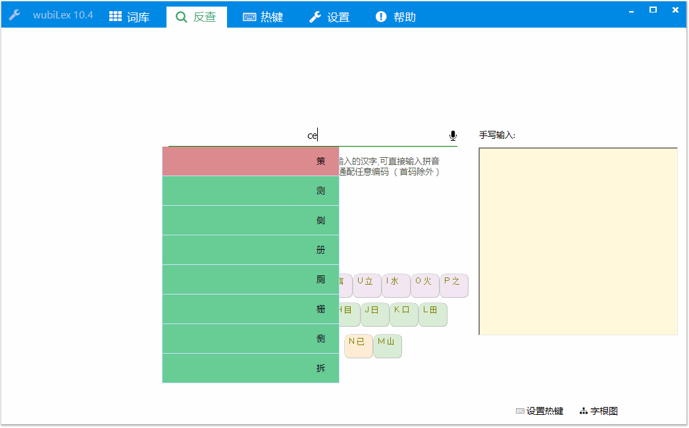
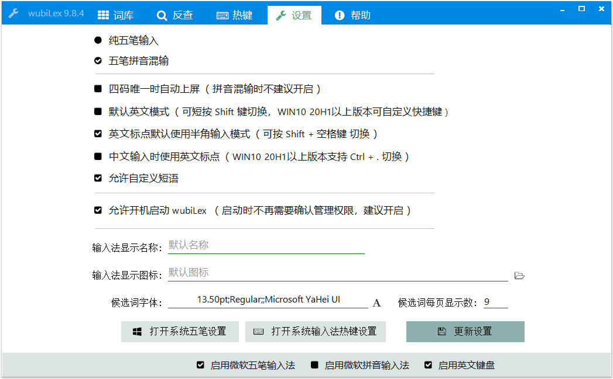
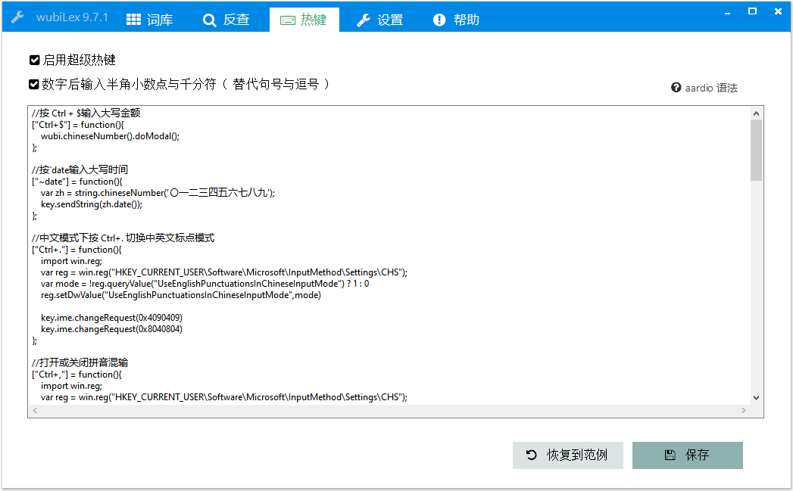
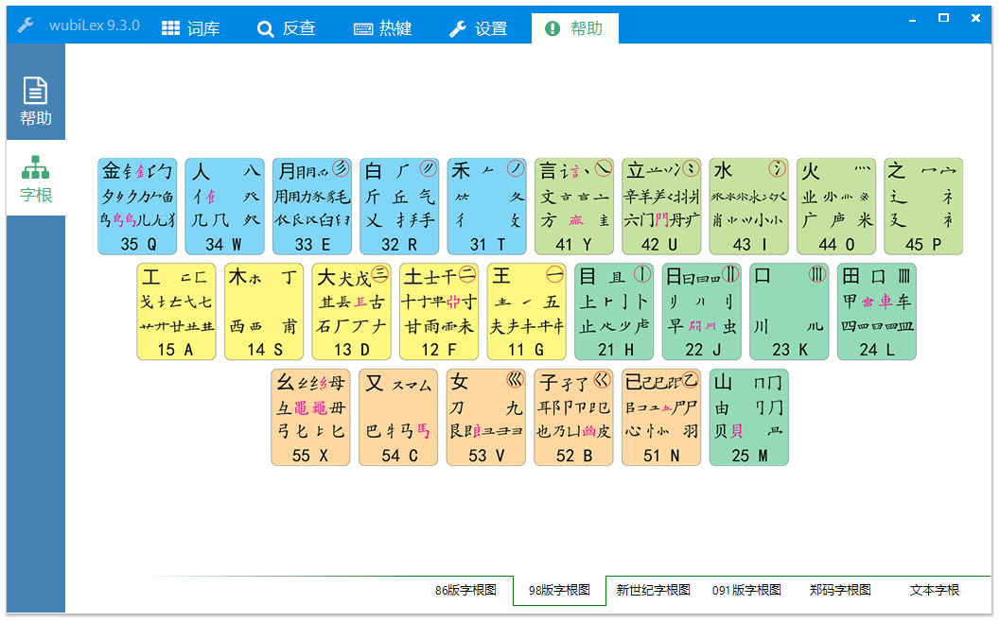

# wubiLex ( Win10 五笔助手 )
WIN10系统自带五笔码表与短语词库安装、管理工具( 可将五笔替换为郑码等其他形码输入法 )，增强微软五笔的设置、热键等功能。

> <a href="http://wubi.aardio.com/update/wubiLex.7z">点这里下载 wubiLex( Win10 五笔助手 )，</a>  体积仅890KB。   
> 软件界面以全部功能使用使用纯<a href="http://www.aardio.com/">aardio 编程语言(开发环境仅6.5MB)</a> 实现。 

   
在WIN10上我试过很多第三方输入法都有兼容性问题，换电脑麻烦，换码表麻烦，
各种折腾以后还会出现一些窗口打不了字，或者打着打着突然卡死了，基本的打字都不行，其他花哨功再多能有什么用呢？！

后来决定试一下微软五笔，用了一段时间，真是好用到停不下来。 但微软五笔还是存在一些问题：
> 1、换码表麻烦，要卸载五笔输入法，重启操作系统，替换以后仍然有乱码缺词等问题。  
> 2、短语词库要一条条的加，删除也只能一条条的删，试想一下如果自定义几百个符号那要点到什么时候？！  
> 3、微软五笔本来是支持时间变量的，然后输入时并不是当前时间，一直是设置的时间。  
> 4、如果使用微软五笔设置页添加短语，与系统码表出现冲突，会出现奇怪的候选词丢失或错位问题。  
> 5、不支持一些26键码表，不支持一些键名字不是按4下的码表。  
> 6、微软五笔的设置不好找，另外中文模式英文标点等选项直接找不到，但实际上是可以改的。  
> 7、字体只能选预设的几个，有些码表带的字符用默认字体显示不了。  

现在上面这些问题都可以使用 wubiLex 解决。
但是不得不说，除了上面这些问题，微软五笔还是很好用的，简洁方便流畅，兼容性好。

为了解决上述的问题，我自己写了一个开源软件 wubiLex :
> 这是一个WIN10系统自带五笔的码表与短语词库安装、管理工具，并可增强微软五笔的设置、热键等功能。
发布后的软件仅820KB, 只要一个EXE文件，不需要安装，不需要任何DLL依赖。软件已自带五笔86、98、091、新世纪码表，以及极点五笔、QQ五笔、
微软五笔默认词库、昱琼词库、海峰词库等。甚至自带了小鹤音形、郑码词库、表形码词库等，可以一键把微软五笔替换为小鹤音形输入法、郑码输入法、表形码输入法。


上面的图片中我们可以看到 wubiLex 甚至可以将微软五笔一键替换为郑码输入法，
其实这个手动替换是有些麻烦的，在五笔中z键是通配键 - 而在郑码中z键是可以用来编码的，
在五笔中连按四下是键名字 - 而在郑码中这是普通编码不能单字优先。但是 wubiLex 可以自动解决这些问题。

wubiLex 可以兼容很多的码表格式，例如词前码后、码前词后，一码一行，一行多码等等，
并可以直接导入RIME码表、极点码表、微软码表等等。可以导入导出CSV、JSON、以及LAMA压缩格式码表，方便把码表转换为其他编程语言易于处理的格式。

wubiLex 也支持直接编辑五笔短语词库（实时生效，不需要点击很多步骤到设置面板去导入）。
并扩展了微软五笔短语的功能，兼容各种短语词库格式，支持方便的自定义特殊字符数组。
可自动识别26键码表并自动安装z键编码的词条到短语词库（实现一键安装郑码）。

wubiLex提供了方便的反查拆字功能。按 Ctrl + F2 反查五笔编码，再Ctrl + F2 回到原来窗口不影响继续输入。
反查可显示详细的拆字图解（五笔反查不仅支持单字，也可以支持词组）。并提供虚拟键盘准确显示按键方位，鼠标悬停在虚拟键上可显示单键字根图。


我们一般看到的五笔字根图都是包含所有按键字根的全图，但是这种字根图会让人眼花缭乱，如果我们的眼睛看到的内容越多，记忆效率就会越低。所以我制作了这种简洁版的虚拟键盘，因为非常简洁，反查的时候会清晰明确的显示某个字词的按键位置、按键顺序，越简洁明确的图示 - 记忆效率就越高。如果我们把鼠标移动到某个按键上，就会显示此按键的字根图 - 要知道一次专注记一个键的字根会比记忆眼花缭乱的全图容易得多。

另外， wubLex 提供了系统五笔设置、热键设置快捷入口。
在这里我们可以快捷的修改一些常用的、或者微软五笔本身没有提供的选项,
增加了原微软五笔设置页未提供的选项,例如中文模式下输入英文标点,以及英文标点默认全角半角等等。
我们甚至可以利用 wubiLex 修改微软五笔的图标、输入法名称等等，在这里我们也可以为输入法候选窗指定更多的字体。


另外，wubiLex还提供了强大的「超级热键」功能，可以用于扩展输入法功能，
列如输入数字后自动将句号转换为小数点，输入大写中文数字的中文日期等等。

这里补充一个重要的超级热键，  
效果：中文模式下按 Ctrl+. 切换中英文标点模式。  
将下面的代码复制到「超级热键」中，然后点击「保存」按钮即可生效。  
``` javascript
["Ctrl+."] = function(){    
    import win.reg;  
    var reg = win.reg("HKEY_CURRENT_USER\Software\Microsoft\InputMethod\Settings\CHS");  
    var mode = !reg.queryValue("UseEnglishPunctuationsInChineseInputMode") ? 1 : 0  
    reg.setDwValue("UseEnglishPunctuationsInChineseInputMode",mode)	  
      
    key.ime.changeRequest(0x4090409)  
    key.ime.changeRequest(0x8040804)  
};  
```

补充： WIN10 20H1已经默认支持 Ctrl +. 快捷键   
  
再介绍一个超级热键：按Ctrl+$ 打开财务大写、日期时间大写、数学运算工具。    
将下面的代码复制到「超级热键」中，然后点击「保存」按钮即可生效。    
``` javascript
["Ctrl+$"] = function(){  
    wubi.chineseNumber().show();  
};  
```

效果如下：  
 


wubiLex 的帮助页面收集整理了很多微软五笔常用快捷键、用法帮助。  
注意：WIN10 20H1以上版本已经可以关闭 Shift, Ctrl+Space 等快捷键。  

并提供了五笔86、五笔98、五笔新世纪（06版）、五笔091、郑码等字根图，
整理收集了所有可以直接复制粘贴的文本字根(不需要安装自定义字体)

 
